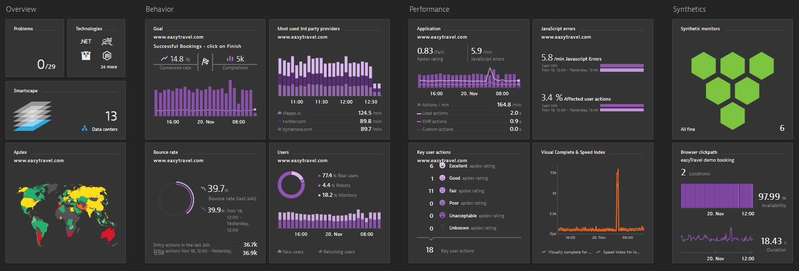
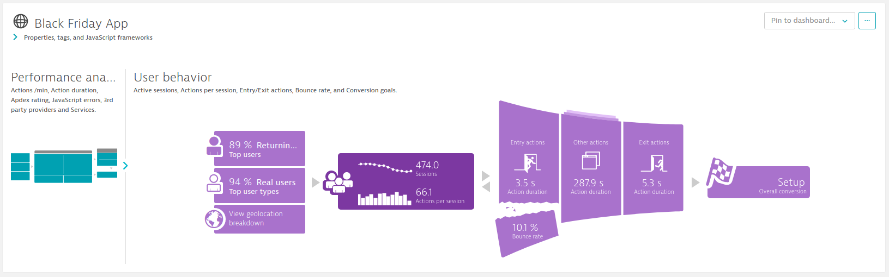

## BLACK FRIDAY, great opportunity or frightening ???

Are you looking forward to BLACK FRIDAY as a great opportunity or are you scared that your webshop won’t hold it?

- Do you know if your digital channels can handle the load on this top day?
- Are you sure about that the experience of your customers is still optimal during these high traffic spikes?
- What are the consequence of performance degradation?
- Where are you looking at on your monitor screens? Backend metrics, transactions? What are they telling about the end-to-end user experience?

In order to gain real insights into the user experience of your visitors and potential customers, you thoroughly need Digital Experience Monitoring which tracks all end-to-end flows.

- How is my e-commerce website used?
- Who are my users?
- Where are my users located? In which regions should I adjust my marketing for example?
- Which page is visited the most / least? 
- What about the conversion rates? 
- How is the real experience of every single visitor?
- What if something goes wrong? How fast can I take the right actions to fix it?

Let’s not think black and let’s assume that you will survive and even do some great business. What do you learn from your customers to improve your digital platform even more?

With our Digital Experience Monitoring offering based on Dynatrace you have the answer to all these questions which enables you to excel in your market.

[Let us help you!](https://www.realdolmen.com/en/solution/dynatrace-for-performance-management)

